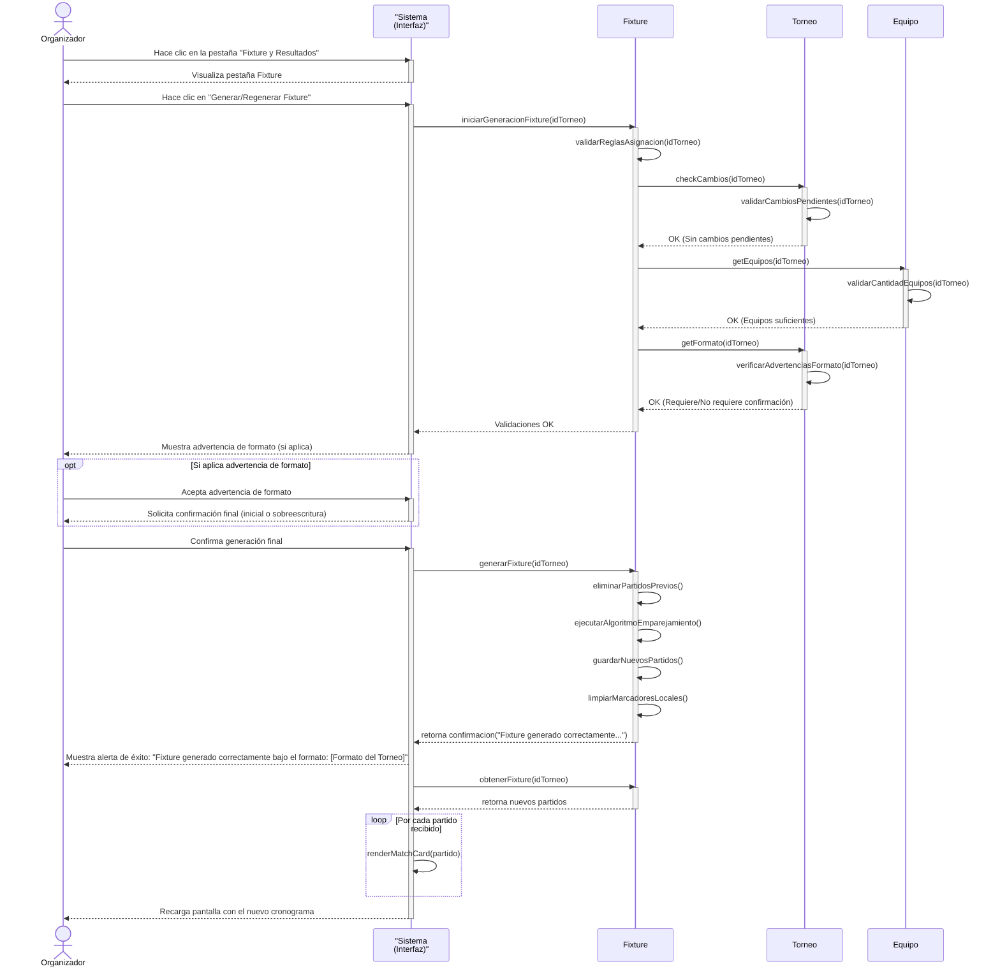
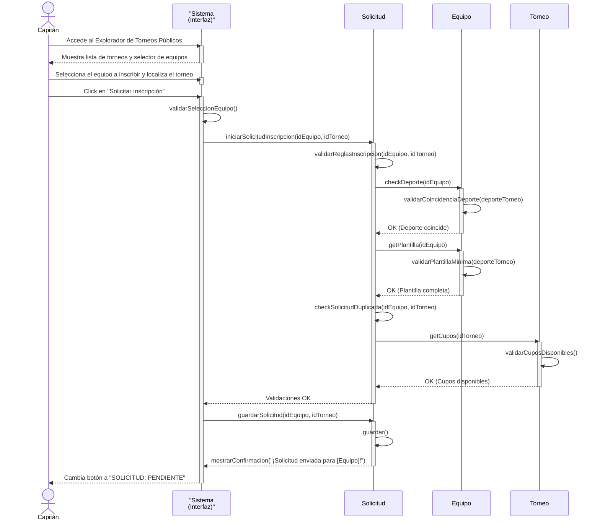
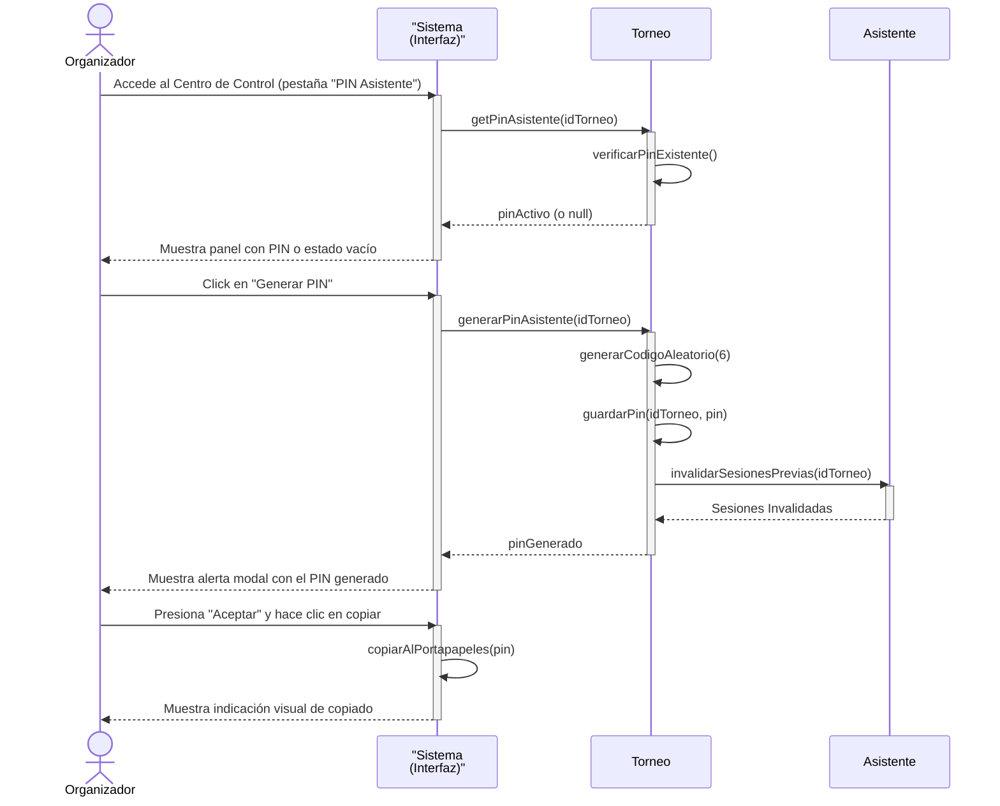
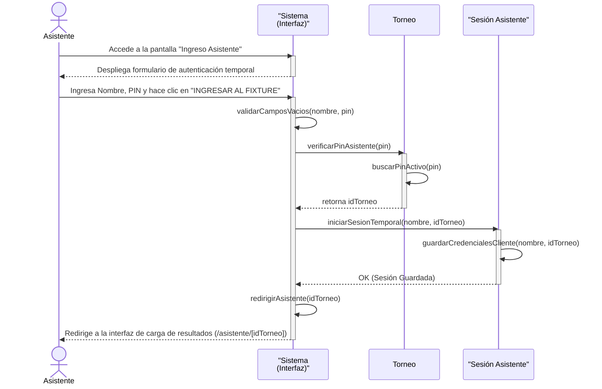

# 3.3 Caso de Uso 1: Crear Nuevo Torneo

**Actor:** Organizador / Asistente de Campo.

---

## Detalle de la Conversación

El siguiente cuadro detalla el flujo de interacción entre el **Actor (A)** y el **Sistema (S)** para el registro de un nuevo torneo, mapeando los componentes frontend (`formTorneo.jsx` y `admin_dashboard.jsx`) y el backend (`guardar_torneo.php`).

| Acción (A) | Curso Normal (S) | Curso Alternativo (S / A) |
| :--- | :--- | :--- |
| **1. A:** Accede al panel principal. | **1.1 S:** Muestra opciones del panel de administración (Dashboard con estadísticas y el botón de creación). | |
| **2. A:** Selecciona "+ Crear Torneo". | **2.1 S:** Despliega el formulario de Registrar Nuevo Torneo con todos sus campos vacíos o por defecto. | |
| **3. A:** Ingresa los datos del torneo: - *Nombre del Torneo* - *Deporte* - *Categoría* - *Formato* - *Capacidad Máx. Equipos* - *Fecha de Inicio* - *Fecha de Fin* | | |
| **4. A:** Hace clic en el botón "Crear Torneo". | **4.1 S:** Valida que no haya campos obligatorios no ingresados.  **4.2 S:** Valida que la fecha de inicio no sea menor a la fecha actual del día de creación del torneo (PHP).  **4.3 S:** Valida los campos ingresados en el cliente (coherencia lógica de las fechas y del formato de competencia). | **[Campos Obligatorios Incompletos]** **4.1.1 S:** Muestra advertencia del navegador: *“Completa este campo”* (atributo `required`). **4.1.2 A:** Regresa al paso 3 para completar los campos.  **[Fecha de Inicio en el Pasado - PHP]** **4.2.1 S:** Verificar output. Si la fecha de inicio es menor a la actual, retorna un error de servidor: *`{"status": "error", "mensaje": "La fecha de inicio no puede ser menor a la fecha actual."}`*. **4.2.2 A:** Regresa al paso 3.  **[Fecha de Fin Anterior a Inicio - React]** **4.3.1 S:** Muestra mensaje de alerta: *“La fecha de finalización no puede ser anterior a la fecha de inicio.”* **4.3.2 A:** Regresa al paso 3.  **[Capacidad Insuficiente en Grupos - React]** **4.3.3 S:** Muestra mensaje de alerta: *“Para el formato 'Fase de Grupos' la capacidad máxima debe ser de al menos 4 equipos.”* **4.3.4 A:** Regresa al paso 3.  **[Llave Imperfecta en Eliminatoria - React]** **4.3.5 S:** Muestra mensaje de confirmación (`confirm`): *“Has configurado una capacidad de X equipos para un torneo Eliminatorio. Al no ser un número exacto para llaves perfectas (4, 8, 16...), el sistema asignará 'Byes' (pases directos) a algunos equipos en la primera ronda. ¿Deseas continuar?”* **4.3.6 A:** Selecciona *"Cancelar"* para cambiar la cantidad de equipos (regresa al paso 3) o *"Aceptar"* para continuar con el flujo normal. |
| | **5. S:** Registra el torneo en la base de datos, muestra un mensaje de creación de torneo exitoso (*“¡Torneo creado con éxito!”*) y redirige al panel principal actualizando la lista de torneos. | **[Fallo de Conexión o Base de Datos]** **5.1 S:** Muestra mensaje de alerta: *“No se pudo conectar con el servidor”* o *“Error: [mensaje del sistema]”*. **5.2 A:** Regresa al paso 3. |
| **6. Fin Caso de Uso** | | |

---

## Detalles Técnicos y Reglas de Negocio en el Código

> [!NOTE]
> ### 1. Campos del Formulario y Valores por Defecto
> Definidos en el estado inicial de [FormTorneo (line 10-18)](file:///home/shiox/Olympia-Project/olympia-app/src/formTorneo.jsx#L10-L18):
> * **Nombre**: `nombreTorneo` (vacío por defecto, obligatorio).
> * **Deporte**: `deporteTorneo` (por defecto `'Futbol'`). Opciones: *Fútbol, Básquet, Vóley, Ping-Pong*.
> * **Categoría**: `categoriaTorneo` (por defecto `'Libre'`). Opciones: *Sub-18, Libre, Veteranos, Junior*.
> * **Formato**: `formatoTorneo` (por defecto `'Liga'`). Opciones: *Liga, Eliminatoria, Fase de Grupos*.
> * **Capacidad**: `maxEquipos` (por defecto `4`, mínimo dinámico: 4 para *Grupos* y 2 para otros).
> * **Fecha Inicio**: `fechaInicio` (vacío por defecto, tipo `date`).
> * **Fecha Fin**: `fechaFin` (vacío por defecto, tipo `date`).

> [!TIP]
> ### 2. Validaciones Específicas del Lado del Cliente (React)
> Implementadas en el manejador del envío del formulario [handleSubmit (line 84-143)](file:///home/shiox/Olympia-Project/olympia-app/src/formTorneo.jsx#L84-L143):
> * **Coherencia de Fechas**: Se compara mediante `new Date(formData.fechaFin) < new Date(formData.fechaInicio)`.
> * **Mínimo de Equipos para Grupos**: Valida que si el formato es `'Grupos'`, la capacidad sea mayor o igual a `4`.
> * **Llaves de Eliminatorias**: Valida si el número ingresado es potencia de 2 utilizando el operador binario `(maxEq & (maxEq - 1)) === 0`. Si no lo es, advierte al usuario de la generación de "Byes".

> [!WARNING]
> ### 3. Validación de Fechas en el Backend (PHP)
> En la llamada al archivo [guardar_torneo.php](file:///home/shiox/Olympia-Project/olympia-backend/guardar_torneo.php), la inserción a la base de datos se realiza con sentencias preparadas.
> Para cumplir con la restricción de que la fecha de inicio del torneo no sea anterior a la fecha actual en el servidor, se puede incorporar el control correspondiente antes de ejecutar el `INSERT`.

---
---

# 3.4 Caso de Uso 2: Crear Nuevo Equipo

**Actor:** Organizador / Capitán de Equipo.

---

## Detalle de la Conversación

El siguiente cuadro detalla el flujo de interacción para el registro de un nuevo equipo y su vinculación opcional a un torneo, mapeando el componente frontend (`formEquipo.jsx`) y el backend (`guardar_equipo.php`).

| Acción (A) | Curso Normal (S) | Curso Alternativo (S / A) |
| :--- | :--- | :--- |
| **1. A:** Accede a la opción de crear equipo en su panel. | **1.1 S:** Despliega el formulario de Registrar Nuevo Equipo. | |
| **2. A:** Selecciona un torneo disponible de la lista (opcional) e ingresa los datos del equipo: - *Nombre del Equipo* (obligatorio) - *Descripción corta / Ciudad* (obligatorio) - *Categoría* - *Deporte* | | |
| **3. A:** Hace clic en "CREAR EQUIPO Y ABRIR PLANTILLA". | **3.1 S:** Valida que no haya campos obligatorios vacíos.  **3.2 S:** Envía la información al servidor (`guardar_equipo.php`). | **[Campos Obligatorios Vacíos]** **3.1.1 S:** Muestra advertencia en pantalla: *“Todos los campos obligatorios deben ser completados”*. **3.1.2 A:** Regresa al paso 2.  **[Fallo del Backend - Modo Prototipo]** **3.2.1 S:** Verificar output. Si el servidor no responde o hay error de base de datos, el sistema guarda el registro en el almacenamiento local del navegador (`localStorage`) para asegurar el flujo de la demostración. **3.2.2 A:** Continúa al paso 4 gracias al respaldo local. |
| | **4. S:** Muestra mensaje de éxito (*“¡Equipo registrado con éxito! Redirigiendo a gestión de plantilla...”*), persiste localmente la inscripción (creando la solicitud de inscripción al torneo si fue seleccionado) y redirige automáticamente. | **[Fallo Total de Registro]** **4.1.1 S:** Si no se puede registrar ni de forma local ni remota, muestra error: *“Error al registrar el equipo.”*. **4.1.2 A:** Regresa al paso 2. |
| **5. Fin Caso de Uso** | | |

---

## Detalles Técnicos y Reglas de Negocio en el Código

> [!NOTE]
> ### 1. Carga de Torneos Disponibles
> El formulario consulta dinámicamente los torneos llamando al backend en [cargarTorneos (line 21-41)](file:///home/shiox/Olympia-Project/olympia-app/src/formEquipo.jsx#L21-L41).
> Si el servidor está inactivo, posee un listado simulado (mock) para evitar que la aplicación quede bloqueada.

> [!TIP]
> ### 2. Persistencia Dual para Prototipos
> Implementado en [handleSubmit (line 52-134)](file:///home/shiox/Olympia-Project/olympia-app/src/formEquipo.jsx#L52-L134):
> * El cliente almacena el equipo en `localStorage` bajo la clave `'olympia_equipos'`.
> * Si se vincula un torneo, crea un objeto de solicitud pendiente en `'olympia_solicitudes'`.
> * Simultáneamente, envía un `POST` JSON con la estructura `id`, `nombre_equipo`, `descripcion_equipo`, `categoria_equipo`, `deporte_equipo` e `id_torneo` al backend.

> [!WARNING]
> ### 3. Transacción Segura en el Servidor (PHP)
> El archivo [guardar_equipo.php](file:///home/shiox/Olympia-Project/olympia-backend/guardar_equipo.php) maneja una transacción SQL (`$conn->begin_transaction()`). Esto garantiza que el equipo se guarde en la tabla `Equipo` y se registre su vinculación en `Torneo_equipo` de forma atómica; si alguna inserción falla, se ejecuta un `$conn->rollback()` total.

---
---

# 3.5 Caso de Uso 3: Generar Fixture

**Actor:** Organizador.

---

## Detalle de la Conversación

El siguiente cuadro detalla el flujo de interacción para la generación o regeneración del fixture (cronograma de partidos) de un torneo según su formato, estructurado de forma secuencial y lineal para facilitar el diseño de diagramas de secuencia.

| Acción (A) | Curso Normal (S) | Curso Alternativo (S / A) |
| :--- | :--- | :--- |
| **1. A:** Hace clic en la pestaña "Fixture y Resultados" en el Centro de Control del torneo. | **1.1 S:** Muestra la sección del Fixture (si ya existe, lista los partidos previos y el botón "Regenerar Fixture"; si no, muestra el botón "Generar Fixture"). | |
| **2. A:** Hace clic en el botón "Generar Fixture" o "Regenerar Fixture". | **2.1 S:** Valida en el cliente (React) que no haya cambios pendientes en los equipos participantes asignados (`hayCambios === false`).  **2.2 S:** Valida en el cliente (React) que el número de equipos asignados cumpla con el mínimo del formato (mínimo 2 equipos en general, o mínimo 4 para "Fase de Grupos").  **2.3 S:** Si el formato del torneo lo requiere (liga impar o eliminatoria imperfecta), muestra una advertencia de formato y solicita confirmación para continuar. | **[Cambios Pendientes de Asignación]** **2.1.1 S:** Muestra advertencia de cambios sin guardar: *“Tienes cambios sin guardar en los participantes. Guárdalos primero antes de generar el fixture.”* (Nota: El término "participantes" en el mensaje en pantalla hace referencia a los **equipos inscritos** en el torneo, no a los jugadores individuales). **2.1.2 A:** Hace clic en “Aceptar” en la alerta. **2.1.3 A:** Hace clic en la pestaña “Asignar Equipos”. **2.1.4 A:** Hace clic en el botón “Guardar Cambios” (o “Cancelar Cambios”). **2.1.5 S:** Guarda los cambios de asignación y desactiva el flag de cambios (`hayCambios = false`). **2.1.6 A:** Regresa al paso 1.  **[Equipos Insuficientes]** **2.2.1 S:** Muestra advertencia indicando la insuficiencia de equipos según el formato del torneo. **2.2.2 A:** Hace clic en “Aceptar” en la advertencia. **2.2.3 A:** Hace clic en la pestaña “Asignar Equipos” para añadir más equipos. **2.2.4 A:** Regresa al paso 2.1.4 para guardar los cambios y luego al paso 1.  **[Advertencias Rechazadas]** **2.3.1 A:** Hace clic en "Cancelar" en la advertencia de formato. **2.3.2 S:** Detiene el flujo sin realizar cambios y vuelve al paso 1. |
| **3. A:** Si aplica, acepta la advertencia de formato en la interfaz (React) haciendo clic en "Aceptar". | **3.1 S:** Muestra la confirmación final de generación de fixture (advirtiendo sobre la eliminación de partidos anteriores si el fixture ya existía). | **[Confirmación Final Cancelada]** **3.1.1 A:** Hace clic en "Cancelar" en la confirmación final. **3.1.2 S:** Detiene el flujo sin realizar cambios y vuelve al paso 1. |
| **4. A:** Confirma la generación final haciendo clic en "Aceptar" en la confirmación final. | **4.1 S:** Envía la solicitud al servidor/backend para procesar la generación de partidos según el formato del torneo.  **4.2 S:** Si la generación es exitosa, limpia el almacenamiento local (`localStorage`) que contiene el fixture anterior y muestra la alerta de éxito: *“Fixture generado correctamente bajo el formato: [Formato del Torneo].”*  **4.3 S:** Actualiza el estado de la aplicación consultando el nuevo fixture y refresca la pantalla con el nuevo cronograma y tabla de posiciones. | **[Fallo de Conexión o Servidor]** **4.1.1 S:** Muestra mensaje de error: *“Error al conectar con el servidor para generar fixture.”* o el error de respuesta devuelto por el backend. **4.1.2 A:** Hace clic en “Aceptar” y regresa al paso 1. |
| **5. Fin Caso de Uso** | | |

### Diagrama de Secuencia del Caso de Uso (Curso Normal)

---

## Detalles Técnicos y Reglas de Negocio en el Código

> [!NOTE]
> ### 1. Restricciones del Frontend
> Implementadas en [validarGeneracionFixture (line 146-171)](file:///home/shiox/Olympia-Project/olympia-app/src/GestorEquipos.jsx#L146-L171) y [handleGenerarFixture (line 173-213)](file:///home/shiox/Olympia-Project/olympia-app/src/GestorEquipos.jsx#L173-L213):
> * Impide iniciar la generación si el flag `hayCambios` está activo.
> * Utiliza la operación de bits `(cantidad & (cantidad - 1)) === 0` para detectar si el número de equipos clasificados a Eliminatorias es potencia de 2 (ej. 2, 4, 8, 16, 32).
> * Ofrece avisos de confirmación en caso de que ocurran descansos o byes.

> [!TIP]
> ### 2. Algoritmia y Rotación en el Backend (PHP)
> En el archivo [generar_fixture.php (line 55-133)](file:///home/shiox/Olympia-Project/olympia-backend/generar_fixture.php#L55-L133) se implementa la generación automática:
> * **Liga (Round Robin)**: Si la cantidad de equipos es impar, se añade un equipo fantasma (`null`). Se rotan los equipos fijando el primer elemento y rotando los demás cíclicamente (algoritmo Round Robin).
> * **Fase de Grupos**: Divide los equipos equitativamente de forma modular (`$i % $num_grupos`) en grupos (Grupo A, B, C...) y luego corre el algoritmo Round Robin para cada grupo de forma aislada.
> * **Eliminatoria**: Calcula la potencia de 2 superior más cercana. Si la cantidad de equipos es menor a dicha potencia, se calcula la diferencia (`$byes`) y únicamente se emparejan a jugar a los equipos excedentes en una "Fase Preliminar". Los equipos restantes pasan de ronda sin cruces en esta jornada inicial.

> [!WARNING]
> ### 3. Integridad y Limpieza
> Al generar el fixture, el backend elimina todos los partidos previos del torneo (`DELETE FROM Partido WHERE id_torneo = ?`). Además, el cliente limpia los marcadores locales almacenados (`localStorage.removeItem('olympia_partidos_...')`), por lo que cualquier marcador cargado previamente se descarta definitivamente.

---
---

# 3.6 Caso de Uso 4: Inscribir Equipo

**Actor:** Capitán de Equipo.

---

## Detalle de la Conversación

El siguiente cuadro detalla el flujo de interacción para que un Capitán de Equipo solicite la inscripción de su club en un torneo público, mapeando el componente frontend (`ExploradorTorneos.jsx`) y el backend de sincronización (`guardar_solicitud.php`).

| Acción (A) | Curso Normal (S) | Curso Alternativo (S / A) |
| :--- | :--- | :--- |
| **1. A:** Accede al Explorador de Torneos Públicos desde su panel de control. | **1.1 S:** Muestra la lista de torneos activos/programados disponibles, así como un selector con los equipos de los cuales el usuario es capitán. | |
| **2. A:** Selecciona el equipo a inscribir y localiza el torneo de su interés en la grilla. | | |
| **3. A:** Hace clic en el botón “Solicitar Inscripción” del torneo. | **3.1 S:** Valida que haya un equipo seleccionado.  **3.2 S:** Valida la coincidencia de deporte entre el equipo y el torneo.  **3.3 S:** Valida que la plantilla de jugadores del equipo cumpla con el mínimo requerido para ese deporte.  **3.4 S:** Valida que el equipo no posea una solicitud activa (aprobada, pendiente o rechazada) en dicho torneo.  **3.5 S:** Valida que el torneo posea cupos libres superiores a cero. | **[Sin Equipo Seleccionado]** **3.1.1 S:** Muestra error: “Debes registrar o seleccionar un equipo primero.”. **3.1.2 A:** Regresa al paso 2 o crea un nuevo equipo.  **[Conflicto de Deporte]** **3.2.1 S:** Muestra error: “El deporte del equipo (X) no coincide con el del torneo (Y)”. **3.2.2 A:** Regresa al paso 2 para buscar otro torneo.  **[Plantilla Incompleta / Falta de Jugadores]** **3.3.1 S:** Muestra error: “No cumples con el mínimo de jugadores: ‘[Equipo]’ tiene W pero [Deporte] requiere al menos Z jugadores.” **3.3.2 A:** Regresa al paso 2 para completar la plantilla.  **[Inscripción Duplicada]** **3.4.1 S:** Muestra error: “Ya has solicitado la inscripción de ‘[Equipo]’ en este torneo.” **3.4.2 A:** Regresa al paso 2.  **[Sin Cupos Disponibles]** **3.5.1 S:** Muestra el estado del torneo como “Cupos Agotados” con el botón de inscripción deshabilitado. **3.5.2 A:** Regresa al paso 2 para buscar otro torneo con cupos libres. |
| | **4. S:** Confirma el envío mostrando un mensaje (“¡Solicitud enviada para [Equipo]! El organizador la revisará.”) y cambia el botón de acción a estado inactivo de lectura: "SOLICITUD: PENDIENTE". | |
| **5. Fin Caso de Uso** | | |

### Diagrama de Secuencia del Caso de Uso (Curso Normal)

---

---

## Detalles Técnicos y Reglas de Negocio en el Código

> [!NOTE]
> ### 1. Mínimos Requeridos de Jugadores por Deporte
> Implementado en la función auxiliar [getMinPlayers (line 73-81)](file:///home/shiox/Olympia-Project/olympia-app/src/ExploradorTorneos.jsx#L73-L81):
> * **Fútbol**: Mínimo **7** jugadores.
> * **Básquet**: Mínimo **5** jugadores.
> * **Vóley**: Mínimo **6** jugadores.
> * **Ping-Pong**: Mínimo **1** jugador.
> * **Otros**: Mínimo **5** jugadores.

> [!TIP]
> ### 2. Gestión de Estados en Cliente
> El frontend maneja de forma asíncrona la lista de solicitudes a través del `localStorage` bajo la clave `'olympia_solicitudes'`. Esto permite que, independientemente del estado del servidor PHP remoto, las vistas del capitán ([ExploradorTorneos.jsx](file:///home/shiox/Olympia-Project/olympia-app/src/ExploradorTorneos.jsx)) y del organizador ([GestionSolicitudes.jsx](file:///home/shiox/Olympia-Project/olympia-app/src/GestionSolicitudes.jsx)) muestren la información del estado (Pendiente, Aprobado, Rechazado) sincronizada en tiempo real.

> [!WARNING]
> ### 3. Registro Remoto (API)
> La función [handleInscribirse (line 83-153)](file:///home/shiox/Olympia-Project/olympia-app/src/ExploradorTorneos.jsx#L83-L153) ejecuta un fetch a `http://localhost/olympia-backend/guardar_solicitud.php` enviando en formato JSON:
> * `id_torneo`: Clave del torneo seleccionado.
> * `id_equipo`: Identificador único del equipo del capitán.
> * `estado`: Estado inicial `'Pendiente'`.

---
---

# 3.7 Caso de Uso 5: Asignar Asistente

**Actor:** Organizador.

---

## Detalle de la Conversación

El siguiente cuadro detalla el flujo de interacción para que un Organizador genere y asigne un PIN de acceso temporal a un asistente de campo, mapeando la pestaña de configuración del Centro de Control (`GestorEquipos.jsx`).

| Acción (A) | Curso Normal (S) | Curso Alternativo (S / A) |
| :--- | :--- | :--- |
| **1. A:** Ingresa al Centro de Control de un torneo y selecciona la pestaña “PIN Asistente”. | **1.1 S:** Muestra el panel de configuración de acceso temporal. Si ya hay un PIN creado lo exhibe en pantalla junto a la opción de copiar. De lo contrario, indica que no hay ningún PIN generado. | |
| **2. A:** Hace clic en el botón “Generar PIN”. | **2.1 S:** Genera de manera aleatoria un PIN alfanumérico único de 6 caracteres.  **2.2 S:** Guarda el nuevo código de acceso en el almacenamiento local vinculándolo al ID del torneo.  **2.3 S:** Despliega una alerta modal de confirmación informando la clave creada e invalida cualquier sesión activa anterior con códigos previos. | **[Regeneración Cancelada]** **2.1.1 A:** Selecciona "Cancelar" en la advertencia de que ya existe un PIN activo. **2.1.2 S:** Detiene la generación y regresa al paso 1 sin alterar el PIN existente. |
| **3. A:** Presiona “Aceptar” en la alerta y hace clic en el botón de copiar. | **3.1 S:** Almacena el PIN en el portapapeles del sistema e indica visualmente el estado copiado por 2 segundos. | **[Fallo de Copia Automática]** **3.1.1 S:** Si el navegador bloquea el acceso al portapapeles o no lo soporta, despliega una alerta indicando que no se pudo copiar automáticamente. **3.1.2 A:** Selecciona el texto del PIN en pantalla y lo copia manualmente. |
| **4. A:** Envía/comparte el PIN generado al asistente de campo asignado. | | |
| **5. Fin Caso de Uso** | | |

### Diagrama de Secuencia del Caso de Uso (Curso Normal)

---

## Detalles Técnicos y Reglas de Negocio en el Código

> [!NOTE]
> ### 1. Algoritmo de Generación de PIN
> Implementado en la función [handleGenerarPin (line 124-135)](file:///home/shiox/Olympia-Project/olympia-app/src/GestorEquipos.jsx#L124-L135):
> * Utiliza la cadena de caracteres `'ABCDEFGHIJKLMNOPQRSTUVWXYZ0123456789'`.
> * Ejecuta un ciclo de 6 iteraciones seleccionando una posición al azar a través de `Math.floor(Math.random() * caracteres.length)`.

> [!TIP]
> ### 2. Persistencia y Expiración en Local
> * El PIN se almacena en `localStorage` bajo la clave compuesta `olympia_pin_${idTorneo}`.
> * Regenerar el PIN sobrescribe esta misma clave, haciendo que cualquier inicio de sesión posterior con el código previo sea rechazado de inmediato.

> [!WARNING]
> ### 3. Control de Regeneración y Fallo de Portapapeles
> * **Confirmación de Regeneración**: Al hacer clic en "Regenerar PIN", si existe una clave previa, se advierte al usuario sobre la invalidación inmediata de sesiones activas. Si cancela la confirmación, se anula la generación.
> * **Fallo de Copiado**: Si la llamada a `navigator.clipboard.writeText` falla o no está disponible, el sistema captura el error y alerta al usuario para que realice la copia manual del PIN en pantalla.

---
---

# 3.8 Caso de Uso 6: Iniciar Sesión (Asistente)

**Actor:** Asistente de Campo.

---

## Detalle de la Conversación

El siguiente cuadro detalla el flujo de interacción para que un Asistente de Campo inicie sesión temporalmente en un fixture utilizando el código PIN provisto por el Organizador, mapeando el componente (`AccesoPin.jsx`).

| Acción (A) | Curso Normal (S) | Curso Alternativo (S / A) |
| :--- | :--- | :--- |
| **1. A:** Accede a la pantalla de Acceso de Asistente (ej. desde el login general o la ruta `/asistente-pin`). | **1.1 S:** Despliega el formulario de autenticación temporal solicitando Nombre/Apellido y el Código PIN del torneo. | |
| **2. A:** Ingresa su nombre y apellido en el primer campo, y el código PIN provisto por el Organizador en el segundo campo. | | |
| **3. A:** Hace clic en el botón "INGRESAR AL FIXTURE". | **3.1 S:** Valida que el nombre de usuario y el PIN no estén vacíos.  **3.2 S:** Busca en `localStorage` si el PIN ingresado coincide con alguna clave activa de torneo.  **3.3 S:** Inicia la sesión temporal y guarda las credenciales y el rol en las variables del cliente.  **3.4 S:** Redirige al asistente a la interfaz de carga de resultados de su torneo respectivo (`/asistente/[idTorneo]`). | **[Nombre Vacío o Espacios]** **3.1.1 S:** Muestra error: *“Por favor, ingresa tu Nombre y Apellido para identificarte al modificar resultados.”* **3.1.2 A:** Regresa al paso 2.  **[PIN Vacío]** **3.2.1 S:** Muestra error: *“Por favor, ingresa el código PIN de acceso.”* **3.2.2 A:** Regresa al paso 2.  **[PIN Inválido / Expirado]** **3.3.1 S:** Si el código no coincide con ninguna clave activa de torneo en `localStorage` (ni el PIN demo `ref123`), muestra error: *“El código PIN ingresado es incorrecto o ya ha expirado. Por favor, solicita uno nuevo al organizador.”* **3.3.2 A:** Regresa al paso 2. |
| **4. Fin Caso de Uso** | | |

### Diagrama de Secuencia del Caso de Uso (Curso Normal)

---

## Detalles Técnicos y Reglas de Negocio en el Código

> [!IMPORTANT]
> ### 1. Auditoría Obligatoria de Asistentes
> Para garantizar la transparencia y la trazabilidad de los cambios en los marcadores de los partidos, el sistema exige ingresar de forma obligatoria el nombre y apellido en el campo `nombre`. Este dato es guardado en `localStorage` bajo la clave `'olympia_asistente_nombre'` y se escribe en la bitácora de auditoría (logs) cada vez que el asistente actualiza un resultado.

> [!NOTE]
> ### 2. Soporte para PIN de Demostración (Fallback)
> Implementado en [handleSubmit (line 45-50)](file:///home/shiox/Olympia-Project/olympia-app/src/AccesoPin.jsx#L45-L50):
> Si no se encuentra ningún PIN dinámico registrado por un Organizador en el localStorage, el sistema da soporte al PIN quemado de demo `'ref123'` asociándolo de manera automática al torneo con ID `'torneo_1'` (Superliga de Fútbol Amateur).

> [!TIP]
> ### 3. Variables de Sesión Creadas
> Tras autenticar con éxito el PIN, el sistema establece los siguientes valores en el `localStorage` del navegador para permitir el paso del asistente por los filtros del [ProtectedRoute.jsx](file:///home/shiox/Olympia-Project/olympia-app/src/ProtectedRoute.jsx):
> * `olympia_token`: `'true'`
> * `olympia_role`: `'Asistente'`
> * `olympia_asistente_torneo`: `[idTorneo]`
> * `olympia_asistente_nombre`: `[Nombre ingresado]`

